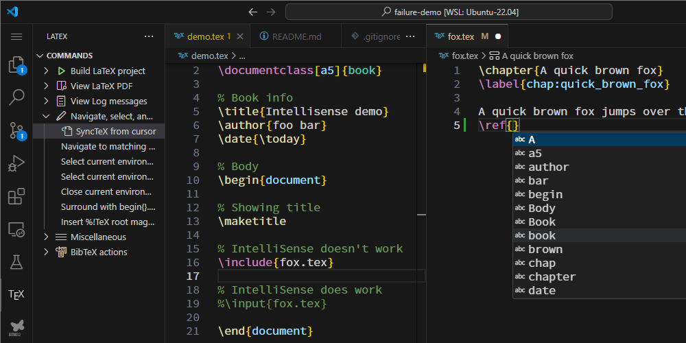

# failure-demo
Warehouse repository of the demonstration of failures. 

# LaTeX-Workshop IntelliSense failure 
The LaTeX-Workshop fails to provide the correct input completion for the \ref command, when using \include command. 

Already [reported to the project as issue](https://github.com/James-Yu/LaTeX-Workshop/issues/4252). 


# Consideration

Adding the latex-workshop.vew.outline.commands to the settings.json may be the trigger of this problem. 

See the [.vscode/settings.json](.vscode/settings.json)

```JSON
    "latex-workshop.view.outline.commands": [],
```
# Screenshot

In the following screen capture, the input completion for \ref command is not working correctly. The fox.tex is included by \include command, in the demo.tex. 


In the following screen capture, the input completion for \ref command is working well. The fox.tex is included by \input command, in the demo.tex. 

